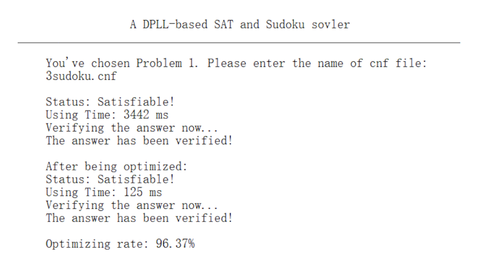
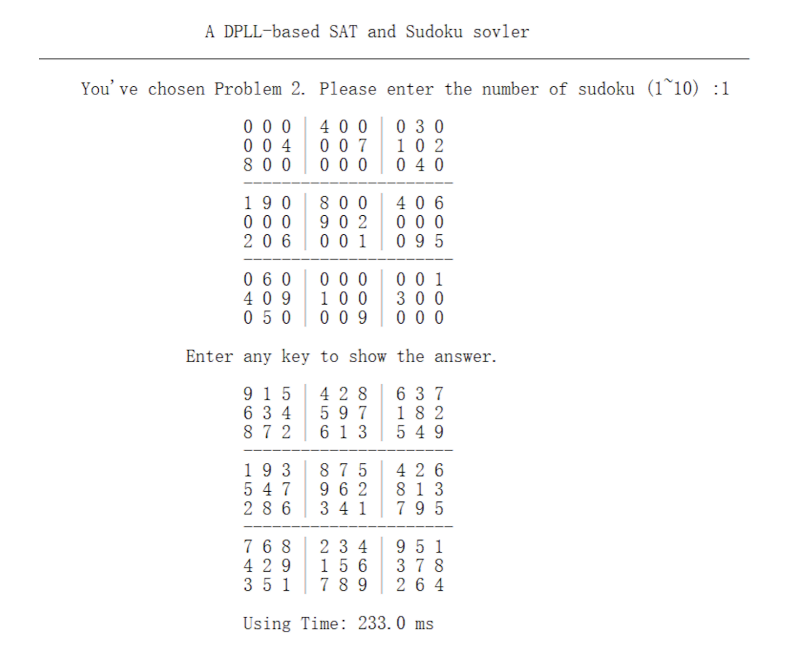

# SAT-Solver
A simple SAT problem solver using DPLL algorithm.

Run the code, enter the file name of the CNF, then you'll get the satisfiability status of the CNF.

You can also choose Problem 2, then you'll get a sudoku problem, enter any key to show the answer.

